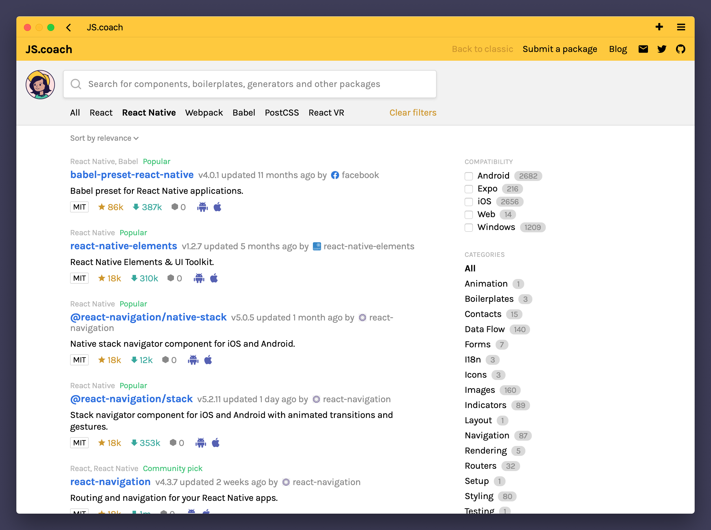

<p align="center">
  <a href="https://js.coach/">
    
  </a>
</p>

<p align="center">
  Welcome to the repository that used to power the client interface.
</p>

---

I started JS.coach in late 2015 and maintained it somewhat actively until 2019.
It has been neglected since then but now, in 2020, the project has new maintainers.
This is an archive of the old version of the site.
You can find the active repository [here](https://github.com/jscoach/server).

<p align="center"><em>Screenshot of the welcome page:</em></p>


<p align="center"><em>Screenshot of the results page:</em></p>



<p align="center"><em>Screenshot of a package modal:</em></p>


<p align="center"><em>Part of web comic – JS coach with Space Horse and Cláudio:</em></p>


<p align="center"><em>Part of web comic – The Great Elogin appears and she wants things shipped:</em></p>


---

### Found a bug or have feedback?

Please open an issue in the [support repository](https://github.com/jscoach/support).
Feel free to submit PRs here.

### Looking for the old source?

Check out the [classic branch](https://github.com/jscoach/support/tree/classic/project).

### Setting up JS.coach

#### Search with Algolia

Duplicate the existing `.env` file in the root directory of this subproject and name it `.env.local`.
This file is already on the `.gitignore` file so you don't accidentally commit it to your repository.
Visit the algolia website and fill the following environment variables:

```bash
# Algolia configs
REACT_APP_ALGOLIA_APP_ID="<your-app-id>"
REACT_APP_ALGOLIA_API_KEY="<your-search-api-key>"
```

Your primary index is used to browse libraries by popularity
(it uses stars, downloads and dependents to rank a library)
and also to sort the results by relevance when the user is searching.
We will now create a replica so the user can browse libraries sorted by "updated at" too.

Open your index page on Algolia and click on the "Replicas" tab.
Click "Add a value" to create a replica index with a name such as "Library_updated_at_development".
If you gave either your primary index or the replica names that don't match the defaults,
you can update the following variables on the `.env` file:

```bash
# List of primary indexes and replicas to search in
REACT_APP_INDEX_BY_RELEVANCE="<your-primary-index-name>"
REACT_APP_INDEX_BY_UPDATED_AT="<your-replica-index-name>"
```

#### Deploying to GitHub pages

GitHub Pages doesn’t support routers that use the HTML5 `pushState` history API under the hood.
To work around that we use a trick to teach GitHub Pages to handle 404 by redirecting to the `index.html` page with a special redirect parameter.
You can find a detailed explanation of this technique [in this guide](https://github.com/rafrex/spa-github-pages).

If you are setting up a Project Pages site and not using a custom domain (i.e. your site's address is `username.github.io/repo-name`),
then you need to set `segmentCount` to `1` in the `404.html` file in order to keep `/repo-name` in the path after the redirect.

Apart from that, deployment works exactly as usual for apps created using `create-react-app`.
